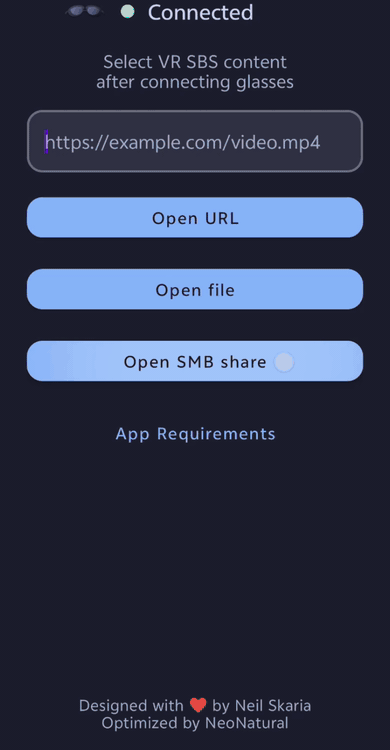
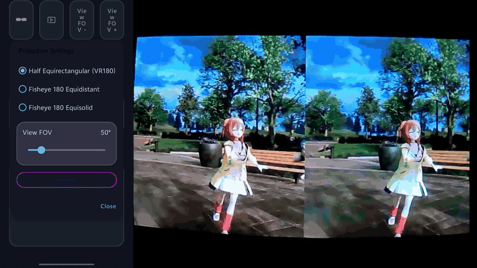
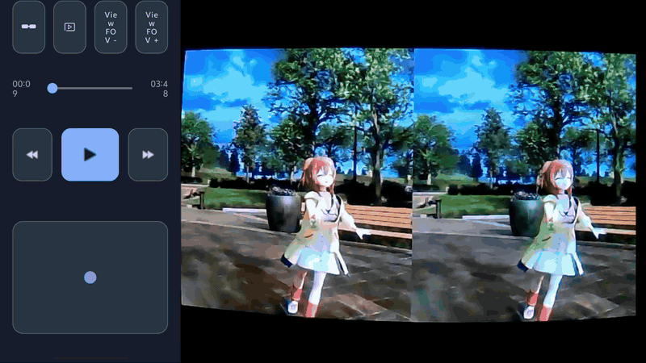

<p align="center">
  
</p>

<p align="center">
  <a href="README.md">English</a> · <strong>简体中文</strong>
</p>

**vr2xr Neo 是一款面向 XREAL One 和 XREAL One Pro 眼镜的 Android VR SBS 视频播放器。** 它支持本地文件、HTTP(S) 地址、Android 分享 Intent 和 SMB2/SMB3 网络共享，并提供手机端控制与 IMU 头部追踪。

本仓库是 [Skarian/vr2xr](https://github.com/skarian/vr2xr) 的持续维护分支。原项目及作者信息见文末，本分支的重点增强如下。

## 本分支重点增强

> **本分支不只是常规维护：**在保留原版 vr2xr 播放体验的基础上，重点加入高性能网络播放、两种新的 VR180 投影模型、更快捷的 FOV 控制，以及更顺畅的追踪设置流程。

- **原生 SMB2/SMB3 播放** — 浏览网络共享、查看缩略图并排序，再通过原生 `libsmb2` 流式播放和拖动跳转大型视频；不兼容时自动回退到 `jcifs-ng`。
- **更广泛的 VR180 格式支持** — 支持半等距柱状、等距鱼眼和等立体角鱼眼内容，并可分别调节视野 FOV 与镜头 FOV。
- **更快捷的视角控制** — 单指直接拖动视角、双指缩放 FOV、使用专用按钮以 5° 步进调节 FOV，并可双击重置视角。
- **更顺畅的设置流程** — 仅在追踪确有需要时进入校准，眼镜连接后可自动启动校准，还可永久隐藏重复出现的 Full SBS 提示。
- **更安全、更易维护** — 使用 Android Keystore 加密保存的 SMB 密码，补全第三方依赖和隐私说明，并为新增策略提供单元测试。

### 相较原项目的详细改动

对比基线为原项目 `main` 分支的 [`52673c5`](https://github.com/skarian/vr2xr/commit/52673c58b376c96a19426bf2a1cff24bd0484685) 提交。

| 范畴 | 本分支的改动 |
| --- | --- |
| 视频来源 | 新增应用内 SMB2/SMB3 入口和网络共享浏览器；本地文件仍使用 Android 系统文档选择器。 |
| SMB 浏览 | 新增服务器、共享名、域和账户登录，支持文件夹导航、可播放视频过滤、缩略图、按新旧排序、保存配置及删除配置。 |
| SMB 播放 | 新增带缓冲随机访问的 Media3 SMB 数据源，支持播放和拖动跳转。优先使用原生 `libsmb2` 提升吞吐，并保留 `jcifs-ng` 回退。 |
| 凭据隐私 | 保存的 SMB 密码使用 Android Keystore 中不可导出的密钥进行 AES-GCM 加密；服务器信息仅保存在应用私有存储中。 |
| 投影模式 | 在原有半等距柱状模式之外，新增 VR180 等距鱼眼和等立体角鱼眼渲染。 |
| 投影控制 | 新增鱼眼镜头 FOV 调节（`160°–220°`），将视野 FOV 范围扩展为 `25°–175°`，修复滑块步进并持久化投影设置。 |
| 触控板控制 | 用直接拖动和双指缩放 FOV 取代边缘连续自动拖动；新增按 5° 调节的 `FOV -` / `FOV +` 按钮，双击可重置视角。 |
| 追踪流程 | 眼镜连接后若不存在追踪流，会自动打开校准；选择视频后仅在必要时进入校准，随后进入 Full SBS 提示。 |
| SBS 提示 | 为 Full SBS 准备界面新增**不再显示**选项。 |
| 启动页与播放器界面 | 新增 SMB 操作入口，将需求帮助改为带文字的按钮，重新组织播放器控制区，并更新应用内项目署名。 |
| 工程维护 | 新增追踪启动策略、SMB 浏览/播放策略和投影配置的单元测试，并补充 SMB 第三方组件及隐私行为说明。 |

---

<p align="center">
  
  &nbsp;
  
  &nbsp;
  
  &nbsp;
  
</p>

## 功能特性

- **支持 XREAL One**：实时头部追踪、连接状态、出厂偏差修正、重新校准、IMU 灵敏度调节及 IMU 追踪开关
- **多种视频来源**：本地文件、`http(s)` 地址、Android 分享 Intent，以及内置的 SMB2/SMB3 网络共享
- **SMB 媒体浏览器**：浏览文件夹、显示视频缩略图、按修改日期排序，并可保存多个服务器配置
- **高吞吐 SMB 播放**：通过原生 `libsmb2` 实现随机读取和拖动跳转，并提供 `jcifs-ng` 兼容回退
- **多种 VR180 投影**：支持半等距柱状、等距鱼眼和等立体角鱼眼投影
- **实时投影调节**：播放过程中调节视野 FOV 和鱼眼镜头 FOV，设置会保存在本机
- **手机端播放控制**：播放/暂停、前后跳转 15 秒、时间轴拖动、投影控制和视角调节触控板
- **引导式追踪设置**：需要时自动进入校准，随后显示可关闭的 Full SBS 提示
- **可靠的播放会话**：眼镜输出中断时自动暂停，输出恢复后可继续播放

## 使用要求

- XREAL One 或 XREAL One Pro 眼镜
- Android 13 或更高版本（`minSdk = 33`）
- 不支持 Samsung DeX 桌面模式，请改用屏幕镜像

本应用不支持仅使用手机播放，也不会自动切换眼镜的 SBS 模式；SBS 模式仍由用户或设备控制。

## 使用指南

1. 连接 XREAL One 或 XREAL One Pro 眼镜。
2. 选择视频来源：

   - 点击 **Open file**，使用 Android 系统文件选择器；
   - 输入 `http(s)` 地址并点击 **Open URL**；
   - 点击 **Open SMB share**，打开网络共享；
   - 或从其他 Android 应用将视频链接或文件分享到 vr2xr。

3. 如果需要校准，将眼镜平放，然后点击 **Run Calibration**。
4. 重新戴上眼镜，并将 `Display > 3D Mode` 设置为 `Full SBS`。可以选择以后不再显示此提示。
5. 点击 **Continue to VR Player**，应用会自动执行 Zero View。
6. 使用手机端控件播放、暂停、跳转、调节投影和改变视角。

如果播放期间眼镜断开，视频会暂停并等待眼镜输出恢复。

## 播放器控制

- **单指拖动**：调节偏航角和俯仰角
- **双指缩放**：连续改变视野 FOV
- **双击**：重置视角
- **FOV - / FOV +**：以 5° 为步长调节视野 FOV
- **眼镜设置**：重新校准、改变 IMU 灵敏度或启用/停用 IMU 追踪
- **投影设置**：选择投影模型并调节视野/镜头 FOV
- **播放控制行**：前后跳转 15 秒、播放/暂停或拖动时间轴

<p align="center">
  
  &nbsp;
  
</p>

## SMB 网络共享

输入服务器主机名或 IP 地址以及共享名。需要身份验证时，还可以填写域、用户名和密码。启用 **Remember this account securely** 可将配置安全地保存在设备上；长按已保存的配置可以将其删除。

浏览器会显示文件夹和支持的视频，在条件允许时生成缩略图，并支持按从新到旧或从旧到新排序。视频数据由设备直接从 SMB 服务器读取，不会复制给开发者或任何中间服务。

<p align="center">
  
</p>

## 构建与测试

克隆时包含子模块，或在克隆后进行初始化：

```bash
git submodule update --init --recursive
```

使用 JDK 17 以及项目配置的 Android SDK/NDK，然后运行：

```bash
./gradlew testDebugUnitTest
./gradlew assembleDebug
```

调试 APK 会生成在 `app/build/outputs/apk/debug/` 目录。更多开发说明见 [`CONTRIBUTING.md`](CONTRIBUTING.md)。

## 隐私与第三方组件

- 本地数据及 SMB 凭据处理方式见 [`PRIVACY_POLICY.md`](PRIVACY_POLICY.md)。
- 内置 `libsmb2` 源码和 `jcifs-ng` 依赖说明见 [`THIRD_PARTY_NOTICES.md`](THIRD_PARTY_NOTICES.md)。
- `libsmb2` 使用 LGPL-2.1-or-later 许可证；项目其余部分遵循本仓库中的相应许可证。

## 致谢

vr2xr 由 [Neil Skaria](https://github.com/skarian) 创建。本分支由 [NeoNatural](https://github.com/NeoNatural) 维护和优化。

原项目地址：[Skarian/vr2xr](https://github.com/skarian/vr2xr)；本分支地址：[NeoNatural/vr2xr-neo](https://github.com/NeoNatural/vr2xr-neo)。
